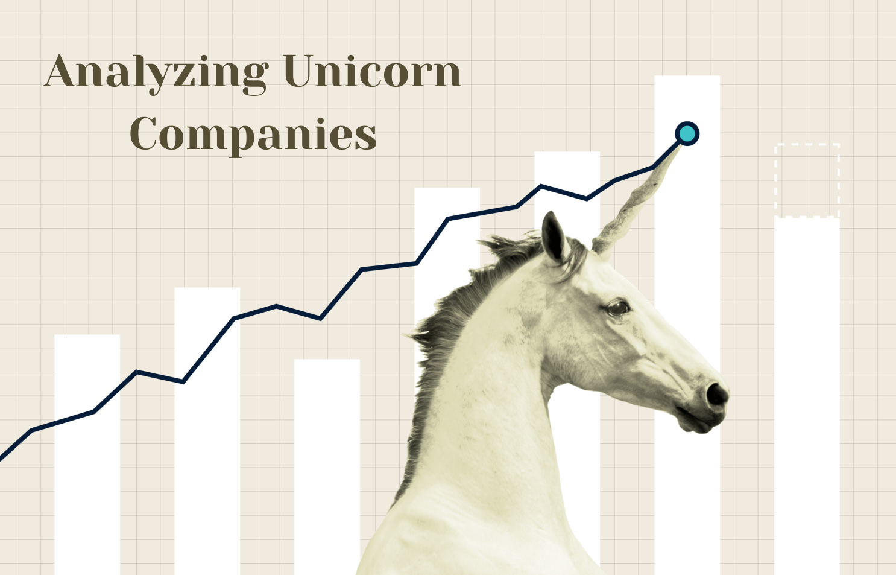

# 
 ⚕️ Analyzing Students' Mental Health 🧠

This repository contains the solutions to the SQL Project- Analyzing Unicorn Companies available on DataCamp. [Click here]("https://app.datacamp.com/learn/projects/1531") to view the complete project on DataCamp's website. 

---
# Project Overview:
To support an investment firm by analyzing trends in high-growth companies. The firm is interested in understanding which industries are producing the highest valuations and the rate at which new high-value companies are emerging. Providing them with this information gives them a competitive insight as to industry trends and how they should structure their portfolio looking forward.

The project's solution and analysis are provided in this file- [Solution.md](Solution.md)

--- 