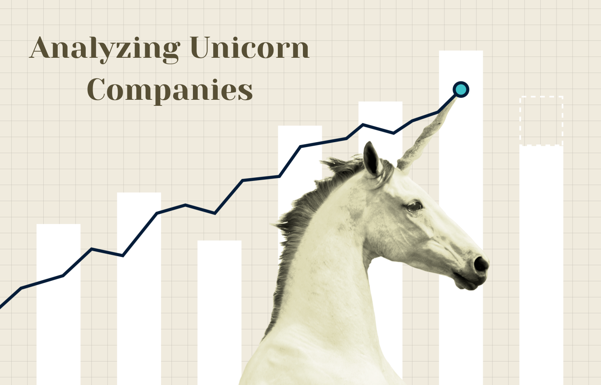

# Analyzing Unicorn Companies- A SQL Project

Did you know that the average return from investing in stocks is [10% per year](https://www.nerdwallet.com/article/investing/average-stock-market-return) (not accounting for inflation)? But who wants to be average?! 

You have been asked to support an investment firm by analyzing trends in high-growth companies. They are interested in understanding which industries are producing the highest valuations and the rate at which new high-value companies are emerging. Providing them with this information gives them a competitive insight as to industry trends and how they should structure their portfolio looking forward.

You have been given access to their `unicorns` database, which contains the following tables:

### dates
| Column       | Description                                  |
|------------- |--------------------------------------------- |
| `company_id`   | A unique ID for the company.                 |
| `date_joined` | The date that the company became a unicorn.  |
| `year_founded` | The year that the company was founded.       |

### funding
| Column           | Description                                  |
|----------------- |--------------------------------------------- |
| `company_id`       | A unique ID for the company.                 |
| `valuation`        | Company value in US dollars.                 |
| `funding`          | The amount of funding raised in US dollars.  |
| `select_investors` | A list of key investors in the company.      |

### industries
| Column       | Description                                  |
|------------- |--------------------------------------------- |
| `company_id`   | A unique ID for the company.                 |
| `industry`     | The industry that the company operates in.   |

### companies
| Column       | Description                                       |
|------------- |-------------------------------------------------- |
| `company_id`   | A unique ID for the company.                      |
| `company`      | The name of the company.                          |
| `city`         | The city where the company is headquartered.      |
| `country`      | The country where the company is headquartered.   |
| `continent`    | The continent where the company is headquartered. |

## The desired outcome: 
Generate a comprehensive analysis highlighting the top three industries with the highest number of unicorn companies and their average valuation in billions over the recent years (2022, 2021, and 2020). The results should be ordered by the most recent year and then by the highest number of unicorn companies.

Our query should return a table in the following format:
| industry  | year | num\_unicorns       | average\_valuation\_billions |
| --------- | ---- | ------------------- | ---------------------------- |
| industry1 | 2021 |        ---          |             ---              |
| industry2 | 2020 |        ---          |             ---              |
| industry3 | 2019 |        ---          |             ---              |
| industry1 | 2021 |        ---          |             ---              |
| industry2 | 2020 |        ---          |             ---              |
| industry3 | 2019 |        ---          |             ---              |
| industry1 | 2021 |        ---          |             ---              |
| industry2 | 2020 |        ---          |             ---              |
| industry3 | 2019 |        ---          |             ---              |

Where `industry1`, `industry2`, and `industry3` are the three top-performing industries.

## Approach:
<ol>
<li><b>CTE 1:</b> Identifying the top three performing industries by evaluating the number of new unicorn companies established over the recent years (2022, 2021, and 2020)
</li>
<li><b>CTE 2:</b> Calculating the number of unicorns and their average valuation, grouped by year and industry.
</li>
<li><b>Combining the two CTEs</b>, rounding off the average valuation (in billions) to two decimal places and finally grouping the result by industry, year and number of unicorns. 
</li>

### The SQL query:
~~~sql
WITH top_industries AS (
	SELECT 
    	i.industry, 
        COUNT(i.*)
    FROM industries AS i
    JOIN dates AS d
        ON i.company_id = d.company_id
    WHERE DATE_PART('year', d.date_joined) IN ('2020', '2021', '2022')
    GROUP BY industry
    ORDER BY count DESC
    LIMIT 3
),

yearly_ranks AS 
(
    SELECT 
    	COUNT(i.*) AS num_unicorns,
        i.industry,
        DATE_PART('year', d.date_joined) AS year,
        AVG(f.valuation) AS average_valuation
    FROM industries AS i
    JOIN dates AS d
        ON i.company_id = d.company_id
    JOIN funding AS f
        ON d.company_id = f.company_id
    GROUP BY industry, year
)

SELECT 
	industry,
    year,
    num_unicorns,
    ROUND(AVG(average_valuation / 1000000000), 2) AS average_valuation_billions
FROM yearly_ranks
WHERE year in ('2020', '2021', '2022')
	AND industry in (SELECT industry FROM top_industries)
GROUP BY industry, year, num_unicorns
ORDER BY year DESC, num_unicorns DESC
~~~

### The output table:
| industry                        | year | num_unicorns | average_valuation_billions |
|---------------------------------|------|--------------|----------------------------|
| Fintech                         | 2022 | 31           | 1.71                       |
| Internet software & services    | 2022 | 28           | 2.00                       |
| E-commerce & direct-to-consumer | 2022 | 7            | 1.57                       |
| Fintech                         | 2021 | 138          | 2.75                       |
| Internet software & services    | 2021 | 119          | 2.15                       |
| Internet software & services	  | 2020 | 20	          | 4.35                       | 
| E-commerce & direct-to-consumer	| 2020 | 16	          | 4                          |
| Fintech	                        | 2020 | 15	          | 4.33                       |

## Visualizations: 
#### A graphical representation illustrating the number of unicorn companies across various industries in the years 2019, 2020, and 2021 will be as follows:

#### A graphical representation of the average valuation of industries over the years will be as follows:

## Conclusion 

### Trend in Number of Unicorns
<ol><li>E-commerce & direct-to-consumer: There is a significant increase in the number of unicorns from 2019 (12) to 2021 (47), showing rapid growth in this industry.
</li>
<li>Fintech: The number of fintech unicorns also shows impressive growth from 2019 (20) to 2021 (138), indicating a booming interest and investment in financial technology solutions.
</li>
<li>Internet software and services: Similar to the other two industries, there is also a marked increase in the number of unicorns, from 13 in 2019 to 119 in 2021.
</li>
</ol>

### Trend in Average Valuation in Billions
<ol>
	<li>E-commerce & direct-to-consumer: The average valuation peaked in 2020 at $4 billion and decreased to $2.47 billion in 2021 despite the increase in the number of unicorns. This might suggest a larger number of smaller-scale startups reaching the unicorn status in 2021 or a general market correction.</li>
	<li>Fintech: There is a noticeable decrease in average valuation from $6.80 billion in 2019 to $2.75 billion in 2021. The decrease in valuation, despite the increase in the number of companies, might indicate market saturation or more conservative valuations as more players enter the market.
	</li>
	<li>Internet software and services: The average valuation was highest in 2020 at $4.35 billion, similar to the other industries, but dropped to $2.15 billion in 2021. This drop mirrors the trend observed in the other sectors, suggesting possible market corrections or adjustments in valuation expectations.
	</li>
</ol>
