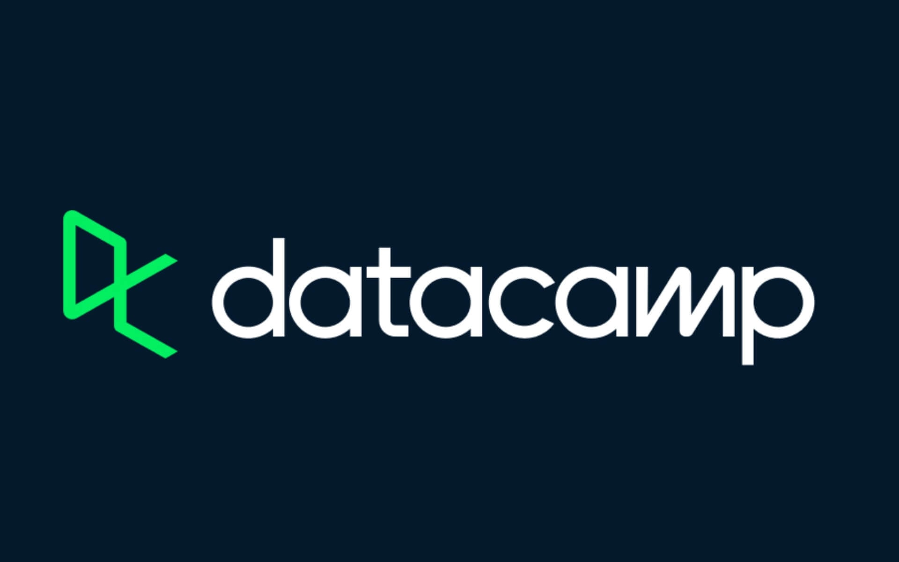

# 
 📔 DataCamp SQL Projects Solutions 📝

This repository contains the solutions to DataCamp's SQL Projects. <a href ="https://app.datacamp.com/learn/projects">Click here</a> to view all the available projects on DataCamp's website.

---
## 🧾 Table of Contents
### 1. [Analyzing Unicorn Companies](#Analyzing%20Unicorn%20Companies)

This project aims to support an investment firm by analyzing trends in high-growth companies. The firm is interested in understanding which industries are producing the highest valuations and the rate at which new high-value companies are emerging. Providing them with this information gives them a competitive insight as to industry trends and how they should structure their portfolio looking forward.

### 2. [Analyzing International Debt Statistics](#Analyzing%20International%20Debt%20Statistics)

In this project, international debt data collected by The World Bank will be analyzed. The dataset provided by the World Bank contains information about the amount of debt owed by developing countries across several categories.

### 3. [Analyzing Electric Vehicle Charging Habits](#Analyzing%20Electric%20Vehicle%20Charging%20Habits)

As electronic vehicles (EVs) become more popular, there is an increasing need for access to charging stations. The aim is to help apartment building managers better understand their tenants’ EV charging habits.

### 4. [Analyzing Students Mental Health](#Analyzing%20Students%20Mental%20Health)

A Japanese International University surveyed its students and published a study on international students having a higher risk of mental health difficulties than a general student. The data from the survey needs to be explored to uncover whether we would arrive at a similar conclusion.

--- 

